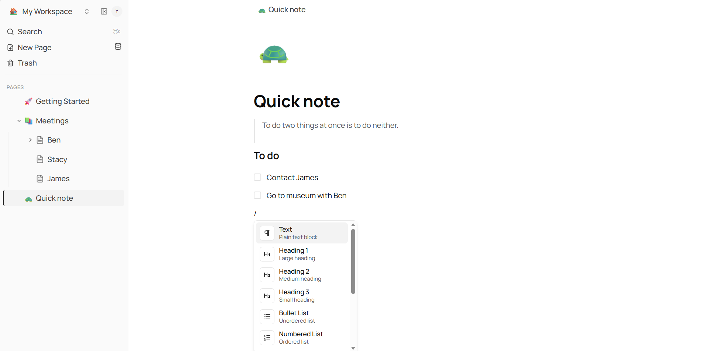

# OpenNote

> **Status:** early/experimental, it's about 80% there.



A self-hostable block-editor workspace you actually own. Write pages, nest them, slash-command your way through blocks, build inline databases, drag things around. Your data lives in a single SQLite file on disk — no accounts, no cloud, no telemetry.

## Why this exists

Most block editors you've used are SaaS: your notes live behind an account, your data sits on someone else's servers, the editor is closed source, and you can't change anything. On the other hand, existing 'opensource' block editors that match quality needs are currently hard to come by. 

OpenNote is:

- **Yours.** Pages are rows in a SQLite file you can back up, grep, or throw in git.
- **Fast to run.** `npm install && npm run dev`. No Docker, no Postgres, no auth setup.
- **Not a toy.** Real block editor (TipTap), real nested pages, real inline databases with views, real drag-and-drop, real search.
- **Hackable.** ~50 files of app code. One function to swap for real auth. MIT license.

Good for: personal notes, team docs you don't want in SaaS, a starting point for a product, anyone tired of paying for a rich editor they could self-host.

## Features

- Rich-text editor with `/` slash commands, tables, task lists, nested pages
- Inline databases (rows-as-pages, table view, filters, column properties)
- Hierarchical pages with drag-and-drop reordering and nesting
- Full-text search across pages
- Favorites, trash with restore
- Keyboard shortcuts (`⌘K` search, `⌘N` new page, `⌘⇧N` new database, `⌘\` toggle sidebar)
- Light / dark / system themes
- Mobile-responsive (sidebar collapses, touch-friendly)
- Multi-workspace + multi-member support in the schema (single-user in the default UI)

## Quick start

```bash
npm install
cp .env.example .env       # default points at a local SQLite file
npx prisma db push         # create the database
npm run dev                # http://localhost:3000
```

That's it. No signup, no configuration. Open the browser and start writing.

## Tech stack

- **Framework:** Next.js 16 (App Router) + React 19
- **Database:** Prisma + SQLite (default). Swap to Postgres by changing `provider` in `prisma/schema.prisma`.
- **Editor:** TipTap with custom extensions (tables, task lists, slash commands, inline comments)
- **State:** Zustand + TanStack React Query
- **UI:** shadcn/ui + Radix primitives + Tailwind CSS v4

## Project layout

```
app/          Next.js routes — main app group + REST API
components/   UI, sidebar, editor, page, database, search, dnd
lib/          Prisma client, hooks, stores, types, auth shim
prisma/       schema.prisma (data model)
```

## Scripts

```bash
npm run dev          # dev server
npm run build        # production build
npm start            # production server
npm run lint         # ESLint
npx prisma studio    # browse the database in a GUI
```

## Adding authentication

The project ships as single-user — every request is resolved to one default user (see `lib/auth-helpers.ts`). The schema already supports multiple users, workspaces, and roles; only the resolver is stubbed.

To add real auth, replace `getAuthUser()` with your provider of choice (NextAuth, Clerk, Supabase, Lucia, a custom JWT, whatever). The rest of the codebase asks for the current user through that one function and will pick up the change.

## Contributing

Issues and PRs welcome. Because this is early, the fastest way to get a change merged is to open an issue first describing what you want to do.

## License

MIT — do whatever you want with it.
